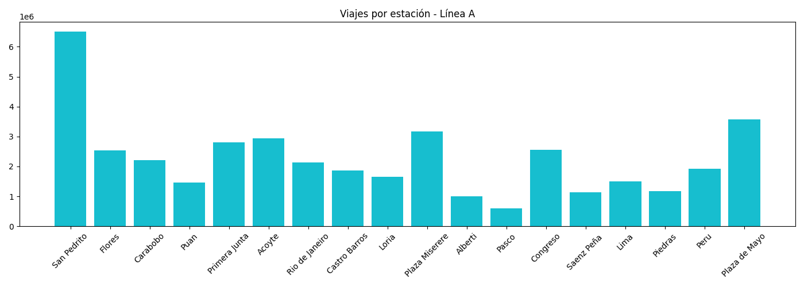
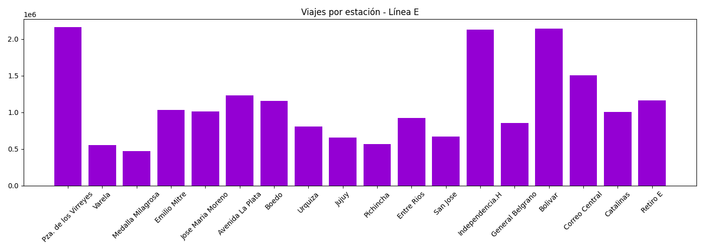
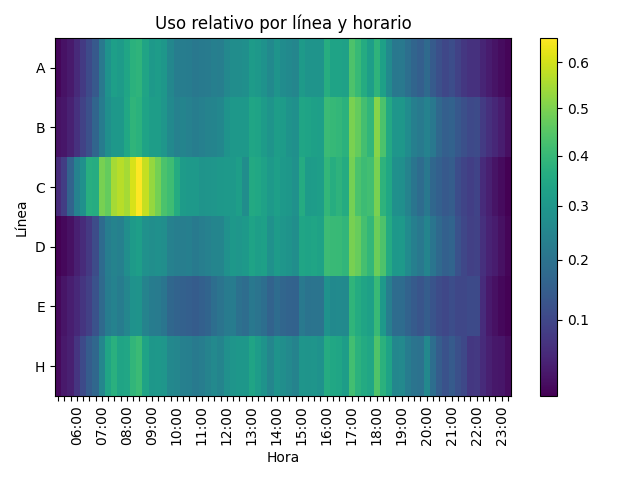

# 🚇 Subte Analytics - Buenos Aires

Análisis de uso del subte de Buenos Aires a partir de datos reales de usos de molinetes por estación y franja horaria a lo largo del año 2024.

## 📊 Qué hace el proyecto

- Procesa datos de pasajeros por línea y estación
- Calcula métricas como:
  - Viajes totales por línea
  - Promedios por estación
  - Distribución horaria
- Genera visualizaciones:
  - Barras comparativas entre líneas
  - Uso promedio por estación
  - Heatmap de demanda por horario

## 📸 Ejemplos
 
### Uso relativo por línea y horario


## ⚙️ Instalación

```bash
git clone https://github.com/TU_USUARIO/subte-analytics.git
cd subte-analytics

python -m venv .venv
source .venv/bin/activate  # Linux / Mac
.venv\Scripts\activate     # Windows

pip install -r requirements.txt

```
## 🧾 Notas técnicas
- El proyecto incluye un módulo lectura_de_archivos.py encargado de procesar los archivos CSV originales.
- Debido al tamaño de los datos, este procesamiento puede demorar varios minutos.
- Para facilitar el uso y la reproducibilidad, los datos ya se encuentran preprocesados y cargados en el proyecto principal.
- Si se desea analizar datos de otro período, es necesario ejecutar nuevamente lectura_de_archivos.py.
- En caso de haber algún cambio en las líneas de subte (nuevas estaciones/líneas), el módulo lectura_de_archivos.py debería modificarse correspondientemente.
- Los datos usados fueron del año 2024. En caso de querer analizar otros datos, modificar en la línea 34 de analisis.py el número 366 por 365 en caso de que el año a analizar no sea bisiesto. 